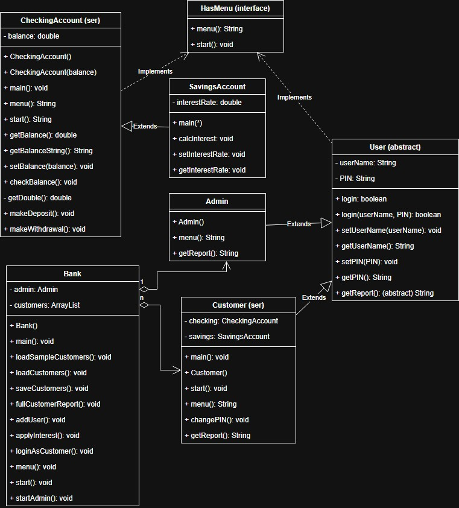

Bank On It 

## HasMenu 
An interface for menuing.
Will created the Scanner object input here since it will be used repeatedly
Contains a menu method that returns a string
Contains another method, start, that will function based off of the string value that menu returns. 

## CheckingAccount
Main() wil create a new CheckingAccount object
The void will start to call the menu and return the users input. Depending on the input results will vary
1-checkbalance: print out the current balance in the account
2-makeDeposit:only make a deposit if number is greater than 0
3-makeWithdrawel: only make a withdrawel if the number is greater than 0 and being less than the total balance
0- exit 

## SavingsAccount
The savings account inherits data from checking account and main creates new SavingsAccount object
Savings interest rate is 0.05d and has a setbalance of 0
The set interestrate takes a string input using a try ctach statement. If a valid input is entered set interest to input
clacinterest takes the current balance in SavingsAccount and applies the current innterest rate

## User
The login prompts the user to enter their userName and PIN, which passes to the loginARGS this returns a boolean
the login ARGS will check if the userName equals inputUserName and PIN equals inputPIN. it will return a boolean
the setters and getters will be used for my PIN and UserName

## Customer 
Customer takes string arguments for UserName and PIN, then creates a new CheckingAccount and SavingsAccount object 
start() calls the menu() method, and based on what is returned will call other methods.
1 - this.checking.start(): CheckingAccount start() method is called.
2 - this.savings.start(): SavingsAccount start() method is called.
3 - this.changePIN: setter for PIN attritubute. 0 - exit.

ChangePIN() takes a string. Then, using regular expressions, checks if the input is valid of being 4 digits and comprised of only numerical characters 

## Admin 
the main intializes new Admin object
Admin() uses setters to set UserName to "Admin" and PIN to "0000"
menu() prompts for input 0-3, then returns a String of that value 
the start will be handled by the bank
getReport() has to be included since Admin inherits User, return null to satisfy the abstract requirements

## Bank
 The main will initializes a new Admin object 
 start() calls the menu() method, and based on what is returned by menu(), calls certain methods.
1 - Admin login: call admin.login() and if returns true, call adminStart().
2 - Customer login: call loginAsCustomer().
0 - Exit.

The menu prompts for input 0-2 which then returns the value 
The start will be left in the bank so the program can run all the functions

